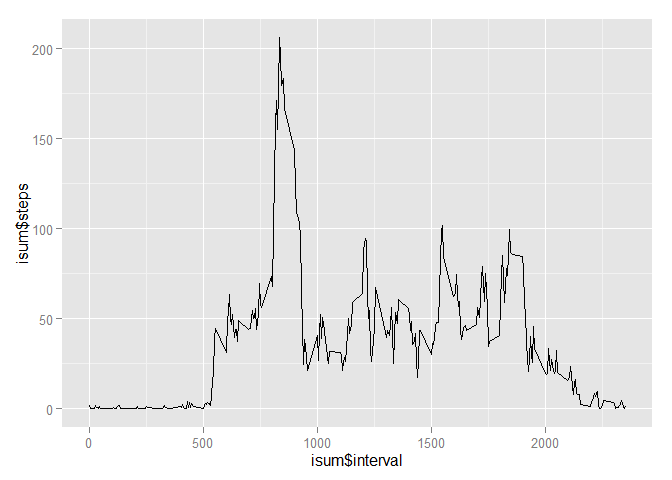

# Reproducible Research: Peer Assessment 1


## Loading and preprocessing the data
First, we load the csv file.

```r
a <- read.csv("activity.csv")
```

## What is mean total number of steps taken per day?
To calculate the number of steps taken per day, we will first aggregate the data by date, then display a histogram.  *dsum* is the summary by day.


```r
dsum = aggregate(steps ~ date, a, sum)
hist(dsum$steps, 10, main="Total Steps Per Day (10/2 - 11/29)", xlab="Number of Steps")
```

 

We would also like to know the mean and median steps per day so we calculate those as well:

```r
mean(dsum$steps)
```

```
## [1] 10766.19
```

```r
median(dsum$steps)
```

```
## [1] 10765
```


## What is the average daily activity pattern?
To analyze the daily patterns, we will aggregate the data by interval.  *isum* will contain this aggregation.  Once we have aggregated, we will display a plot

```r
isum = aggregate(steps ~ interval, a, mean)

library(ggplot2)
```

```
## Warning: package 'ggplot2' was built under R version 3.1.3
```

```r
ggplot(df, aes(x=isum$interval, y = isum$steps, group = 1)) + geom_line()
```

 

We would now like to answer the question "Which 5-minute interval, on average across all the days in the dataset, contains the maximum number of steps?"

To do this, we will, determine the highest value, then locate the interval in *isum* that contains that value:


```r
highest = max(isum$steps)
max = subset(isum, steps == highest)
max
```

```
##     interval    steps
## 104      835 206.1698
```

From this, we see that the interval 08:35-08:40 contains the highest number of steps across all days with an average of 206 steps.

## Imputing missing values
We would all now like to replace all missing values (**na**) with the average value for the interval.


```r
#loop through every row and if the number of steps is missing
#look up the average value for that interval and replace the 
#missing value with the average.
for (row in 1:nrow(a2)) {
  if (is.na(a2[row,]$steps) == TRUE) {
    # get the interval that is missing the value
    i <- a2[row,"interval"]
    
    #determine the average value by looking up in isum
    iavg = isum[isum$interval == i, "steps"]
    
    #replace the value
    a2[row,"steps"] <- iavg    
  }
}
```

Now that we have done that, we will re-aggregate by day, then display a graph of the total steps per day to compare to the first graph.


```r
dsum = aggregate(steps ~ date, a2, sum)
hist(dsum$steps, 10, main="Total Steps Per Day (with na replacement)", xlab="Number of Steps")
```

 

We will also recompute the mean and median values:


```r
mean(dsum$steps)
```

```
## [1] 10766.19
```

```r
median(dsum$steps)
```

```
## [1] 10766.19
```

We see that the mean has remained unchanged, however the median is now equal to the mean.

## Are there differences in activity patterns between weekdays and weekends?

To compare the paterns between weekdays and weekends, we will introduce a variable that reflects the day type of each date.


```r
# Store the day of the week of each date
a2$day.of.week= weekdays(as.Date(a$date))
#initialize everything to weekdays
a2$day.type = "weekday"
#change Saturdays and Sundays to weekends
a2[a2$day.of.week %in% c("Saturday", "Sunday"),]$day.type = "weekend"

#reaggregate by interval with the day type included
isum = aggregate(steps ~ day.type+interval, a2, mean)
```

Now using the aggregated data, we produce a plot to compare the two patterns:


```r
library(lattice)

attach(isum)
xyplot(steps~interval|day.type, type="l",
       xlab = "Interval", ylab="Steps",
       main="Steps by Interval and Day Type", 
       layout=c(1,2))
```

 

Looking at the graphs, we see that on weekends, that activity is more evenly spread throughout the day than on weekdays. We also see that there is a more significant amount of activtiy between 5:00 and 7:30 on weekdays than on weekends.
